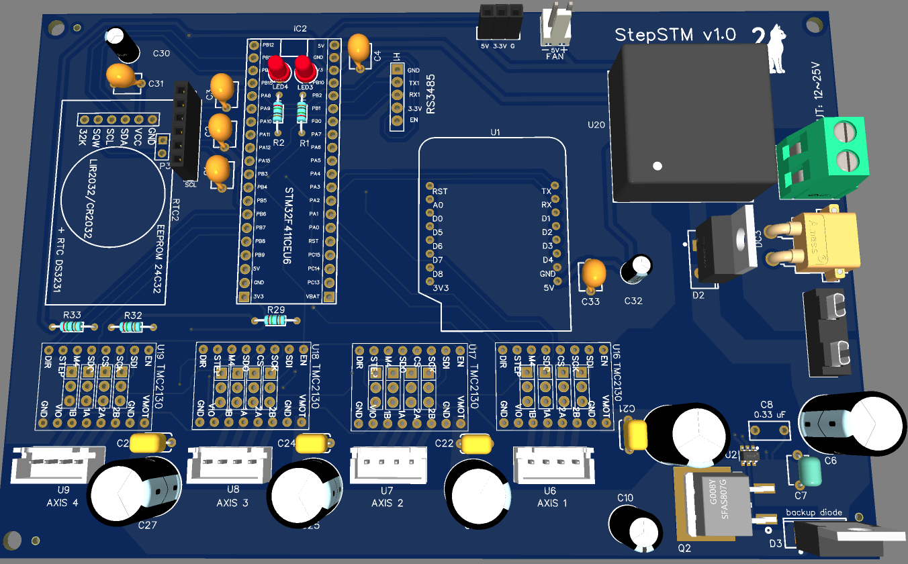
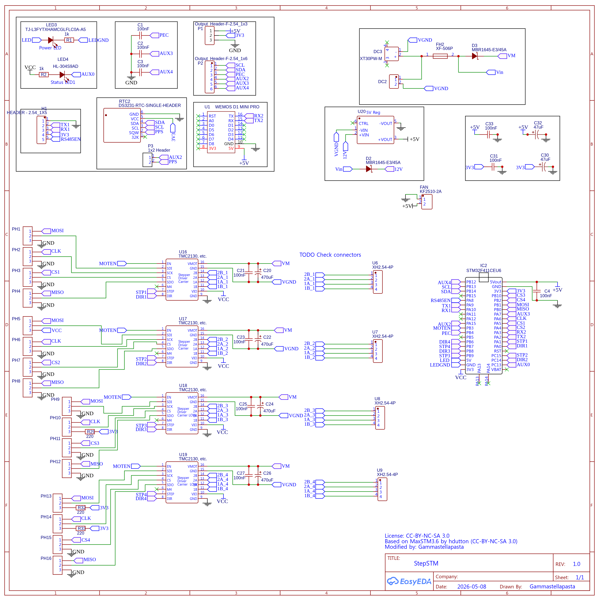
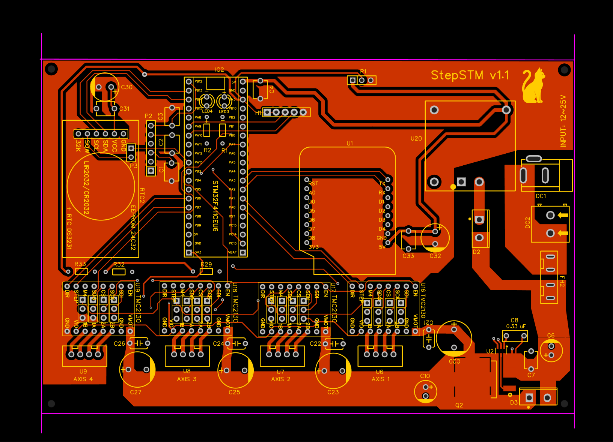
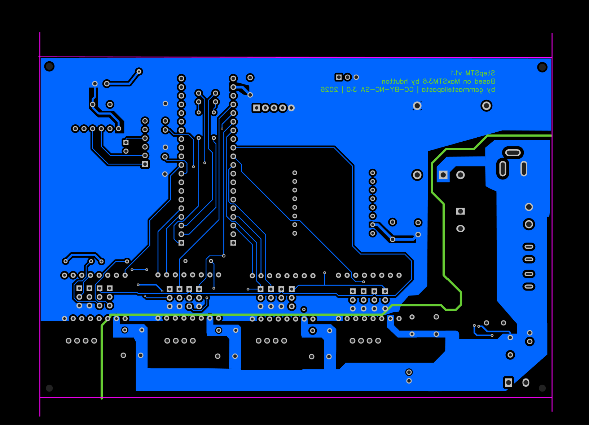

# StepSTM_onstep_custom_pcb
StepSTM
Custom PCB for [OnStepX](https://github.com/hjd1964/OnStepX)

## License
  
This project is licensed under [CC BY-NC-SA 3.0](https://creativecommons.org/licenses/by-nc-sa/3.0/).  
Based on [MaxSTM3.6](https://onstep.groups.io/g/main/wiki/26597) by hdutton, licensed under CC BY-NC-SA 3.0.

## Link
[https://oshwlab.com/gammastellapasta/project_rwiatxym](https://oshwlab.com/gammastellapasta/project_rwiatxym)

---
## Features

- STM32F411CEU6 microcontroller (100 MHz system clock)
- 4-axis stepper motor control
- 4 interchangeable stepper driver modules
- Selectable UART or SPI driver communication
- Integrated MOSFET ideal diode reverse polarity protection
- Wi-Fi connectivity
- RS-485 interface
- Modular driver configuration
- OnStep compatible
- TMC driver support
- High-current power input (max 1xA (work in progress)

## Images

